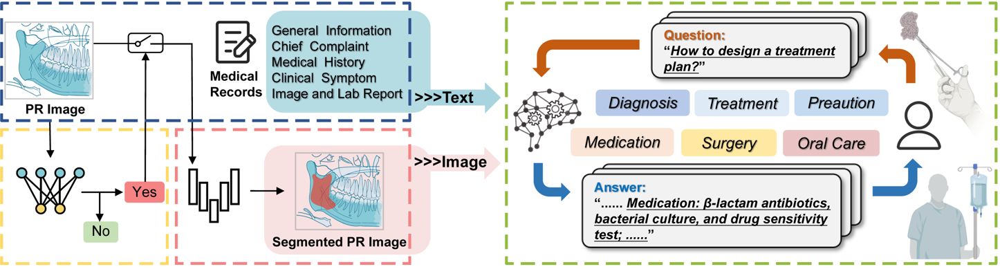

# ONJ-TS-System

ONJ-TS-System is the multimodal large language model developed for diagnosis and treatment supporting of the osteonecrosis of the jaws.



Workflow of the proposed ONJ treatment supporting (ONJ-TS) system. The system comprises 3 modules and processes 2 types of modality data. Interaction with doctors is ultimately achieved through the ONJ Treatment Supporting Module.
Abbreviations: ONJ, osteonecrosis of the jaws. PR, panoramic radiographs.

## Enviroment Setup
```bash
conda create -n onj_ts_system python>=3.11
conda activate onj_ts_system

pip install -r requirements.txt
```

## Train

- ONJ Diagnosis Module

To train all models (i.e., SwinTransformer, CrossViT, ViT, VGG, ResNet, InceptionV3), run the following script:

```bash
cd onj_diagnosis
python exp.py
```

- ONJ Segmentation Module

To train the segmentation module, run the following script:

```bash
cd onj_segmentation
python exp.py
```

- ONJ Treatment Supporting Module

To train the treatment supporting module, make sure the LLaMA-Factory has been installed.

```bash
cd onj_treatment_supporting
llamafactory-cli train examples/train_lora/qwen2vl_lora_sft.yaml
```

## Web App

To launch a web app, run the following script:

```bash
streamlit run app.py
```